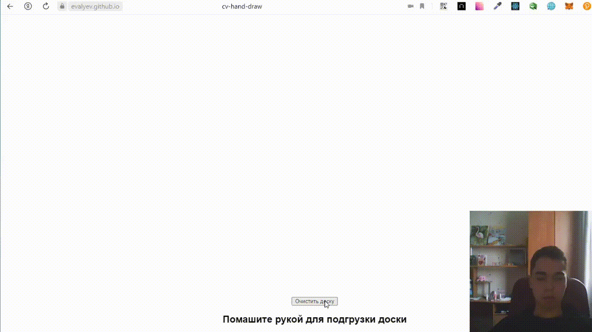

# cv-hand-draw
Веб-приложение для рисования указательным пальцем с веб-камеры на виртуальной доске. Приложение написано на react.

## Запустить проект
Важно запускать проект через Google Chrome (в safari пока что работает плохо)
Перейти по ссылке - https://evalyev.github.io/cv-hand-draw/

</img>